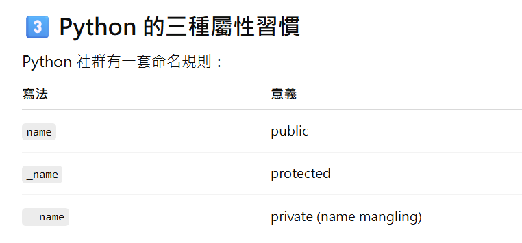

## Day 10 — Python 物件導向進階 (OOP Advanced)

今天的內容正式進入 **Python 物件導向程式設計的進階概念**，且因內容學習自IT鐵人賽，所以應該相當的會有難度。但這些概念在實際開發（Web、AI、後端系統）中非常常見。

今日學習內容：

- `@property`  **控制讀取**
- `__slots__`  **控制修改**
- `@staticmethod`
- `@classmethod`
- 類別之間的關係
- 繼承 (Inheritance)
- 方法覆寫 (Override)
- 多型 (Polymorphism)
- 抽象類別 (Abstract Class)

---
# 重要學習過程圖



# 1️⃣ @property（屬性保護）

在 Python 中，如果屬性名稱以 `_` 開頭，通常代表：

> 這個屬性是受保護的，不建議直接從外部修改。

例如：

```python
self._age
```

為了安全地存取或修改屬性，我們可以使用：

- getter（讀取）
- setter（修改）

`@property` 可以讓 method 看起來像一般屬性一樣使用。

---

## 範例

```python
class Person(object):

    def __init__(self, name, age):
        self._name = name
        self._age = age

    # getter
    @property
    def name(self):
        return self._name

    # getter
    @property
    def age(self):
        return self._age

    # setter
    @age.setter
    def age(self, age):
        self._age = age

    def play(self):
        if self._age <= 16:
            print('%s 正在玩手機' % self._name)
        else:
            print('%s 正在玩電腦' % self._name)
```

使用方式：

```python
person = Person('Andy', 12)

print(person.age)   # 呼叫 getter
person.age = 22     # 呼叫 setter
```

---

# 2️⃣ __slots__（限制物件屬性）

Python 是 **動態語言**，代表我們可以在執行時為物件新增屬性。

例如：

```python
p = Person("Andy",20)

p.height = 180
p.weight = 70
```

但這可能造成：

- 記憶體浪費
- 物件結構混亂

因此可以使用：

```
__slots__
```

來限制物件可以擁有的屬性。

---

## 範例

```python
class Person(object):

    __slots__ = ('_name', '_age', '_gender')

    def __init__(self, name, age):
        self._name = name
        self._age = age
```

如果新增未定義屬性：

```python
person._is_gay = True
```

會出現錯誤：

```
AttributeError
```

---

# 3️⃣ 靜態方法 @staticmethod

有些方法 **不需要使用物件屬性**。

例如：

判斷三角形是否成立：

```
a + b > c
```

這種方法可以寫成 **靜態方法**。

---

## 範例

```python
class Triangle(object):

    def __init__(self, a, b, c):
        self._a = a
        self._b = b
        self._c = c

    @staticmethod
    def is_valid(a, b, c):
        return a + b > c and b + c > a and a + c > b
```

呼叫方式：

```python
Triangle.is_valid(3,4,5)
```

不需要建立 object。

---

# 4️⃣ 類別方法 @classmethod

類別方法是 **與 class 本身有關的方法**。

第一個參數通常命名為：

```
cls
```

代表 **當前類別本身**。

---

## 範例

```python
from time import time, localtime

class Clock(object):

    def __init__(self, hour=0, minute=0, second=0):
        self._hour = hour
        self._minute = minute
        self._second = second

    @classmethod
    def now(cls):
        ctime = localtime(time())
        return cls(ctime.tm_hour, ctime.tm_min, ctime.tm_sec)
```

使用方式：

```python
clock = Clock.now()
```

---

# 5️⃣ 類別之間的關係

在物件導向設計中，類別之間通常有三種關係。

---

## ① is-a（繼承）

表示 **一種是另一種**

例如：

```
Student is a Person
```

程式：

```python
class Student(Person):
```

---

## ② has-a（組合 / 關聯）

表示 **某個物件擁有另一個物件**

例如：

```
Car has Engine
```

---

## ③ use-a（依賴）

表示 **某個類別使用另一個類別**

例如：

```
Driver uses Car
```

---

# 6️⃣ 繼承 (Inheritance)

子類別可以繼承父類別的屬性和方法。

---

## 範例

```python
class Person(object):

    def __init__(self, name, age):
        self._name = name
        self._age = age

    def play(self):
        print('%s 正在玩耍' % self._name)


class Student(Person):

    def __init__(self, name, age, grade):
        super().__init__(name, age)
        self._grade = grade

    def study(self, course):
        print('%s 正在學習 %s' % (self._name, course))
```

`super()` 用來呼叫父類別的方法。

---

# 7️⃣ 方法覆寫 (Override)

子類別可以重新定義父類別的方法。

這稱為 **方法覆寫（override）**。

---

# 8️⃣ 多型 (Polymorphism)

多型代表：

> 相同的方法，在不同物件上會有不同的行為。

例如：

- Dog → 汪汪
- Cat → 喵喵

---

# 9️⃣ 抽象類別 (Abstract Class)

抽象類別是 **不能被建立物件的類別**。

它主要用來被其他類別繼承。

需要使用 `abc` 模組。

---

## 範例

```python
from abc import ABCMeta, abstractmethod

class Pet(object, metaclass=ABCMeta):

    def __init__(self, nickname):
        self._nickname = nickname

    @abstractmethod
    def make_voice(self):
        pass
```

子類別必須實作該方法。

---

## 子類別

```python
class Dog(Pet):

    def make_voice(self):
        print('%s : 汪汪汪...' % self._nickname)


class Cat(Pet):

    def make_voice(self):
        print('%s : 喵喵喵...' % self._nickname)
```

---

# 今日重點整理

今天學習了 Python OOP 的核心概念：

| 概念 | 說明 |
|----|----|
| `@property` | 屬性存取控制 |
| `__slots__` | 限制物件屬性 |
| `@staticmethod` | 靜態方法 |
| `@classmethod` | 類別方法 |
| inheritance | 繼承 |
| override | 方法覆寫 |
| polymorphism | 多型 |
| abstract class | 抽象類別 |